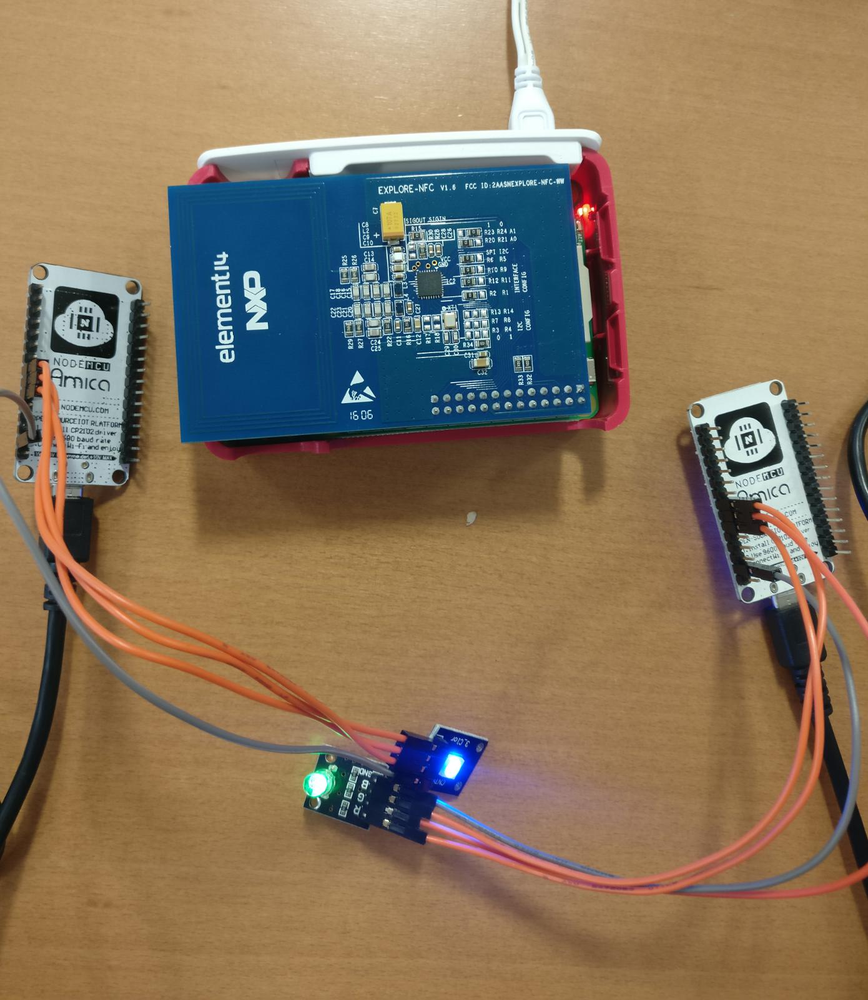
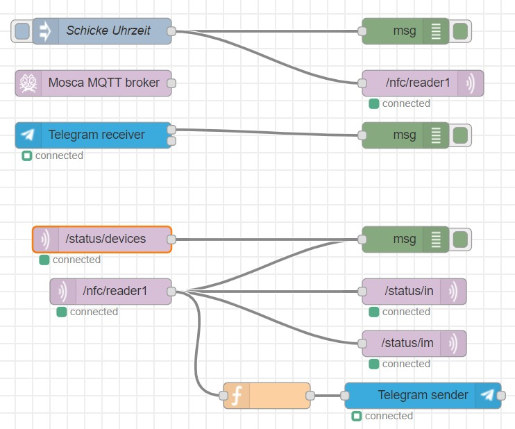
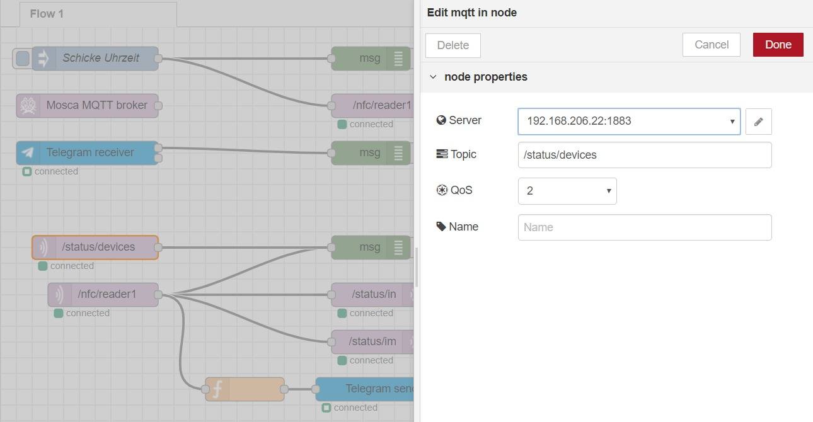
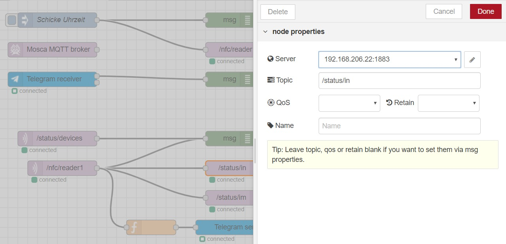
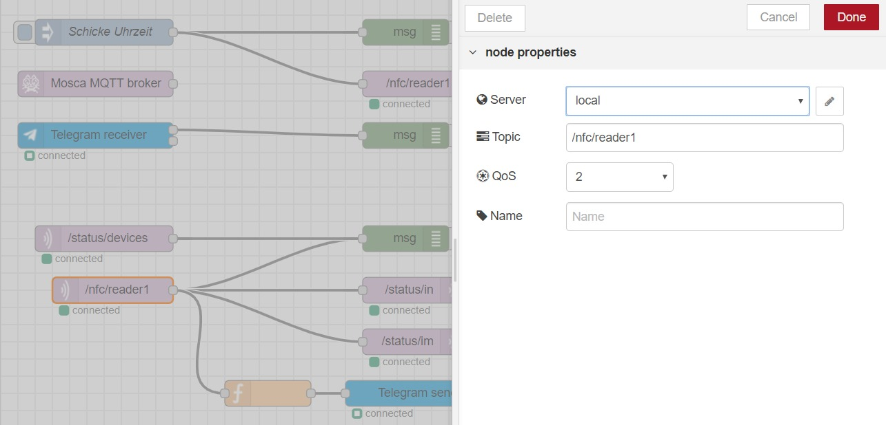
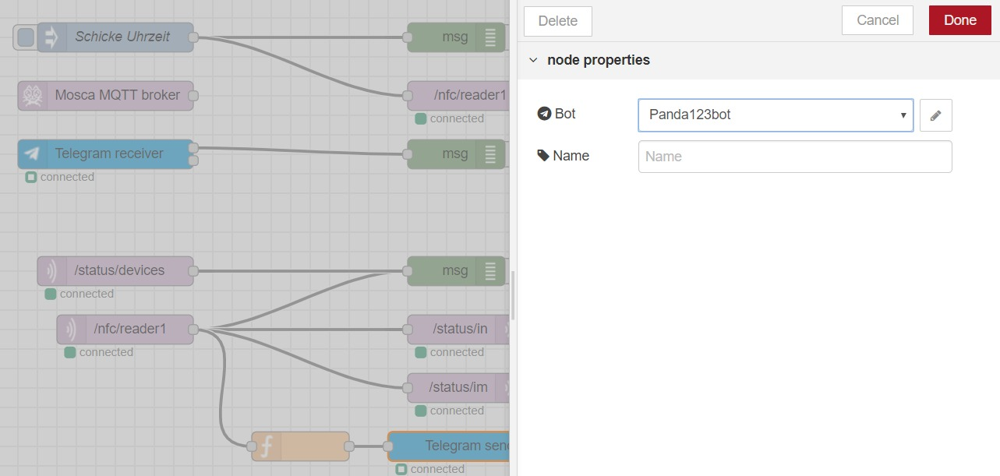

# ArduinoLEDAktivierung
Schulaufgabe

Über WLan wurde eine Verbindung zu zwei NodeMCU hergestellt. Über das NFC-Lesegerät wurden Karten aufgelegt, welches ein Signal sandte, dass die LED-Leuchte die Farbe kurzzeitig verändert, ähnlich eines Lichtsignals.

 	
Im folgenden der Aufbau von nodered:

Infotext zu
/status/devices

/nfc/reader1

/status/in

/status/im

