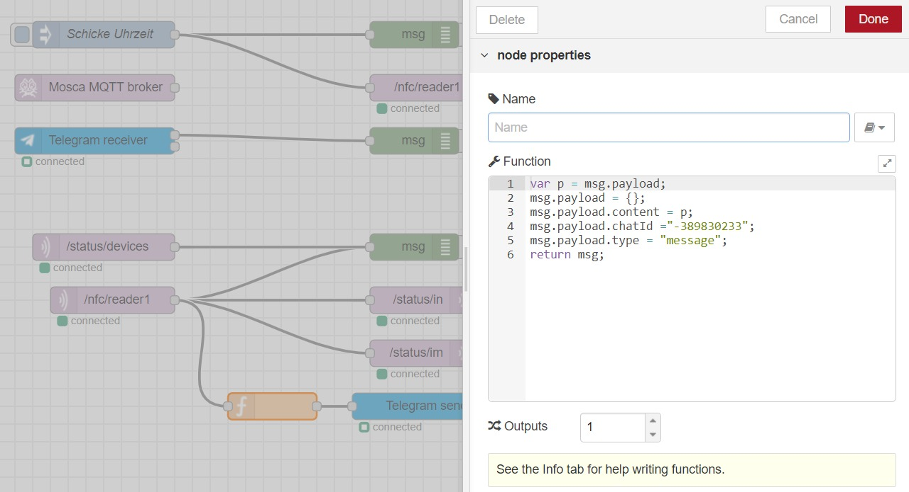

# ArduinoLEDAktivierung
Schulaufgabe

Über WLan wurde eine Verbindung zu zwei NodeMCU hergestellt. Über das NFC-Lesegerät wurden Karten aufgelegt, welches ein Signal sandte, dass die LED-Leuchte die Farbe kurzzeitig verändert, ähnlich eines Lichtsignals.

